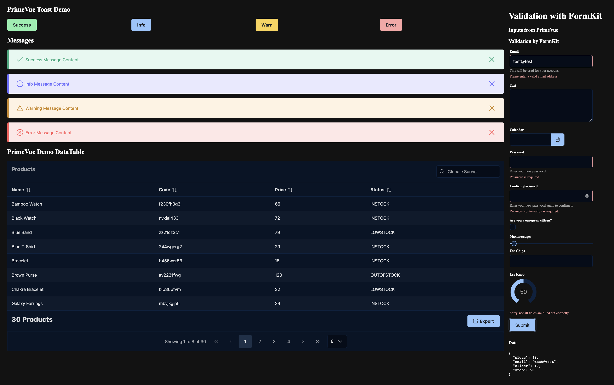

# Nuxt 3 Module PrimeVue

* Load [PrimeVue](https://www.primefaces.org/primevue/setup) Components
* Add PrimeVue Services (usePrimeDataTable)
* [Formkit](https://formkit.com/) Support with [formkit-primevue](https://github.com/sfxcode/formkit-primevue)

## Version

[](https://badge.fury.io/js/@sfxcode%2Fnuxt-primevue)

## Nuxt 3 Demo

[Github: nuxt3-primevue-starter](https://github.com/sfxcode/nuxt3-primevue-starter)

[Netlify:  nuxt3-primevue-starter](https://nuxt3-primevue-starter.netlify.app/)

## Docs

Read more on [Docs](https://sfxcode.github.io/nuxt-primevue)

Tutorial: [Getting started](https://sfxcode.github.io/nuxt-primevue/guide/getting-started.html)

## Usage

Add Module **nuxt-primevue** to **nuxt.config.ts**

```ts

  modules: [
    ...
    '@sfxcode/nuxt-primevue',
    
  ],
```

Create **formkit.config.ts**

```ts
// formkit.config.ts
import type { DefaultConfigOptions } from '@formkit/vue'
import { primeInputs } from '@sfxcode/formkit-primevue'

const config: DefaultConfigOptions = {
  inputs: primeInputs,
}

export default config
```

See [https://github.com/sfxcode/formkit-primevue](https://github.com/sfxcode/formkit-primevue)

## Module Configuration

### Primevue Configuration

```typescript
    config: {
      ripple: true  // default
    }
```

### Formkit Configuration

Shows if formkit should be used with PrimeVue.
In this case PrimeVue components used by formkit-primevue must be imported global.

```typescript
    config: {
      useFormkit: true  // default
    }
```
### Component Configuration

Default all but excluded PrimeVue Components are imported automatically.

Some components in default are excluded because of some SSR problems or needed Third Party Libraries: 
```typescript
export const defaultPrimevueExcludeComponentNames:Array<string>  = [
  'Chart',
  'Editor',
  'FullCalendar',
]


```
Finetuning by components configuration options:

```typescript
components: {
    include: [...defaultPrimeVueComponents(true, true), 'DataTable', 'Column'],
    force: ['Button',{name:'Message', global:true}],
}
```
#### Components Configuration 
**Option include**:

Includes components by name or as PrimeVueComponent. Defaults are not used if not implemented in helper function.

**Option exclude**:

Only if not include is used. Exclude default components by name.

**Option force**:

Force Includes components by name or as PrimeVueComponent.

**Helper Function**:
``` typescript
export function defaultPrimeVueComponents(useFormkit: boolean, onlyGlobal:boolean=false) 
```

## Development

- Run `npm run dev:prepare` to generate type stubs.
- Use `npm run dev` to start [playground](./playground) in development mode.



