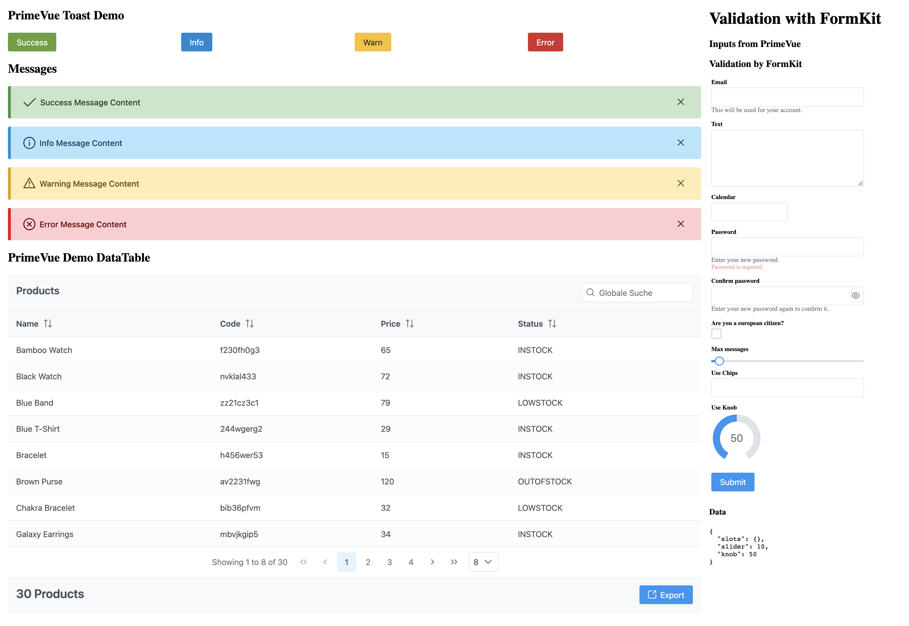

# Nuxt 3 Module PrimeVue

* Load [PrimeVue](https://www.primefaces.org/primevue/setup) Components
* Add PrimeVue Services (usePrimeDataTable)
* [Formkit](https://formkit.com/) Support witf [formkit-primevue](https://github.com/sfxcode/formkit-primevue)

## Version

[](https://badge.fury.io/js/@sfxcode%2Fnuxt-primevue)

## Nuxt 3 Demo

[Github: nuxt3-primevue-starter](https://github.com/sfxcode/nuxt3-primevue-starter)

[Netlify:  nuxt3-primevue-starter](https://nuxt3-primevue-starter.netlify.app/)

## Usage

Add Module **nuxt-primevue** to **nuxt.config.ts**

```ts

  modules: [
    ...
    '@sfxcode/nuxt-primevue',
    
  ],
```

Create **primevue.json**

```json
{
  "ripple": true
}

```


Create **formkit.config.ts**

```ts
// formkit.config.ts
import type { DefaultConfigOptions } from '@formkit/vue'
import { primeInputs } from '@sfxcode/formkit-primevue'

const config: DefaultConfigOptions = {
  inputs: primeInputs,
}

export default config
```

See [https://github.com/sfxcode/formkit-primevue](https://github.com/sfxcode/formkit-primevue)

## Development

- Run `npm run dev:prepare` to generate type stubs.
- Use `npm run dev` to start [playground](./playground) in development mode.



